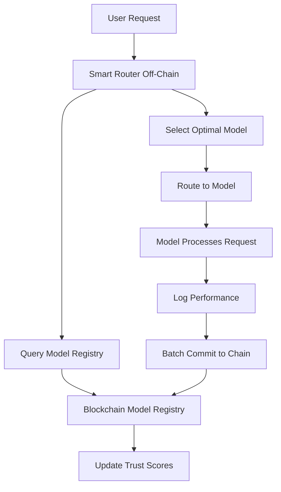

# NTU Blockchain Capstone: Decentralized Model Registry and Routing Audit System

## Project Title
**"ModelChain: Blockchain-Based Trust Layer for AI Model Routing and Performance Verification"**

## Executive Summary

This project challenges students to build a blockchain infrastructure that complements the SightAI Smart Routing system by creating a decentralized model registry and immutable audit trail for routing decisions. While the core routing algorithm runs off-chain for performance, the blockchain provides transparency, accountability, and trust in model selection.

**Duration**: 8 weeks  
**Team Size**: 1-2 students  
**Prerequisites**: Blockchain fundamentals, Solidity, basic understanding of ML models

## The Problem Context

### Smart Routing System Overview
The SightAI platform intelligently routes user requests to the optimal AI model based on:
- **Capability Match**: Which model best handles this type of request?
- **Performance**: Which model provides fastest response?
- **Cost**: Which model is most cost-effective?
- **Quality**: Which model gives best results?

### Trust Challenges in Model Routing

Current centralized routing systems face several trust issues:

1. **Model Provider Trust**
   - How do we verify a model's claimed capabilities?
   - What if a model provider overstates performance?
   - How to ensure fair model selection?

2. **Routing Transparency**
   - Why was Model A chosen over Model B?
   - Is the routing algorithm biased toward certain providers?
   - How to audit routing decisions?

3. **Performance Accountability**
   - Did the model deliver promised latency?
   - Was the quality as expected?
   - How to handle SLA violations?

4. **Model Discovery**
   - How can new models join the ecosystem?
   - How to establish reputation for new models?
   - How to prevent spam/low-quality models?

## Proposed Blockchain Solution

Students will build a blockchain layer that provides:

```
Off-Chain (Fast Routing)              On-Chain (Trust Layer)
━━━━━━━━━━━━━━━━━━━━━━━              ━━━━━━━━━━━━━━━━━━━━━━
• Real-time routing (<10ms)    →     • Model registry & verification
• Embedding calculations        →     • Performance commitments
• Request processing           →     • Routing audit trail
• Model inference              →     • SLA enforcement
```

## Core Components to Build

### Component 1: Decentralized Model Registry (35%)

A smart contract system where AI model providers can register their models with verifiable capabilities.

```solidity
contract ModelRegistry {
    struct Model {
        bytes32 modelId;
        address provider;
        string endpoint;           // Off-chain API endpoint
        ModelCapabilities capabilities;
        PerformanceMetrics metrics;
        uint256 stake;            // Stake for SLA guarantee
        bool isActive;
        uint256 trustScore;
    }
    
    struct ModelCapabilities {
        string[] supportedTasks;   // ["text-generation", "code", "math"]
        string[] languages;        // ["en", "zh", "es"]
        uint256 maxTokens;
        uint256 contextWindow;
        bytes32 embeddingHash;     // Hash of capability embedding
    }
    
    struct PerformanceMetrics {
        uint256 avgLatencyMs;      // Average latency
        uint256 p95LatencyMs;      // 95th percentile latency
        uint256 successRate;       // Success rate (basis points)
        uint256 costPerKToken;     // Cost per 1000 tokens
        uint256 qualityScore;      // 0-100 quality rating
    }
}
```

**Key Features:**
- Model registration with capability declaration
- Stake requirement for quality guarantee
- Capability embedding verification
- Trust score calculation
- Model activation/deactivation

### Component 2: Routing Decision Audit Trail (30%)

Record routing decisions on-chain for transparency and analysis.

```solidity
contract RoutingAudit {
    struct RoutingDecision {
        bytes32 requestId;
        bytes32 requestEmbedding;  // Hash of request embedding
        bytes32 selectedModel;
        bytes32[] candidateModels; // Top-k candidates
        uint256 timestamp;
        RoutingFactors factors;
    }
    
    struct RoutingFactors {
        uint256 capabilityScore;   // How well model matches request
        uint256 latencyScore;      // Expected latency score
        uint256 costScore;         // Cost effectiveness
        uint256 qualityScore;      // Expected quality
        uint256 finalScore;        // Weighted combination
    }
    
    // Merkle tree root of daily routing decisions
    mapping(uint256 => bytes32) public dailyRoutingRoots;
}
```

**Key Features:**
- Batch commit routing decisions (merkle root)
- Selective on-chain recording for important requests
- Routing factor transparency
- Challenge mechanism for disputed routes

### Component 3: Performance Oracle and SLA Enforcement (25%)

Track actual model performance and enforce SLAs.

```solidity
contract PerformanceOracle {
    struct PerformanceReport {
        bytes32 modelId;
        uint256 period;           // Daily/weekly period
        uint256 totalRequests;
        uint256 successCount;
        uint256 avgLatency;
        uint256 maxLatency;
        bytes32 proofHash;        // ZK proof of aggregated metrics
    }
    
    struct SLAViolation {
        bytes32 modelId;
        string violationType;      // "latency", "availability", "quality"
        uint256 severity;         // 1-5 scale
        uint256 slashAmount;     // Amount to slash from stake
    }
}
```

**Key Features:**
- Performance data aggregation
- SLA violation detection
- Stake slashing mechanism
- Performance-based trust updates

### Component 4: Model Reputation System (10%)

Dynamic reputation scoring based on performance history.

```solidity
contract ModelReputation {
    struct ReputationFactors {
        uint256 performanceScore;  // Based on SLA compliance
        uint256 utilizationScore;  // How often selected
        uint256 userRatings;       // Aggregated user feedback
        uint256 longevity;         // Time in system
        uint256 violations;        // Count of SLA violations
    }
    
    function calculateTrustScore(bytes32 modelId) 
        public view returns (uint256);
    
    function updateReputation(bytes32 modelId, 
        PerformanceReport memory report) external;
}
```

## Technical Architecture



## Implementation Roadmap (8 Weeks)

### Week 1-2: Foundation & Model Registry
**Deliverables:**
- Development environment setup
- Basic ModelRegistry contract
- Model registration and activation functions
- Unit tests for registry

**Key Tasks:**
```javascript
// Example model registration
await modelRegistry.registerModel({
    endpoint: "https://api.model-provider.com/v1/chat",
    supportedTasks: ["text-generation", "translation"],
    languages: ["en", "zh", "es"],
    maxTokens: 4096,
    stake: ethers.utils.parseEther("10")
});
```

### Week 3-4: Routing Audit System
**Deliverables:**
- RoutingAudit contract
- Merkle tree implementation for batch commits
- Query functions for routing history
- Integration tests

**Key Implementation:**
```solidity
// Commit batch of routing decisions
function commitDailyRoutings(
    bytes32 merkleRoot,
    uint256 totalDecisions,
    uint256 day
) external onlyOracle {
    dailyRoutingRoots[day] = merkleRoot;
    emit DailyRoutingCommitted(day, merkleRoot, totalDecisions);
}
```

### Week 5: Performance Oracle
**Deliverables:**
- Performance tracking contract
- SLA violation detection
- Stake slashing mechanism
- Test suite for SLA enforcement

### Week 6: Reputation System
**Deliverables:**
- Reputation calculation algorithm
- Trust score updates
- Model ranking system
- Integration with registry

### Week 7: Integration & Testing
**Deliverables:**
- Mock routing system integration
- End-to-end testing
- Gas optimization
- Security audit checklist

### Week 8: Demo & Documentation
**Deliverables:**
- Working demo with UI
- Complete documentation
- Presentation materials
- Final code submission

## Simplified Smart Contract Example

```solidity
// Core contract structure (simplified)
contract ModelChain {
    // Model registry
    mapping(bytes32 => Model) public models;
    mapping(address => bytes32[]) public providerModels;
    
    // Routing audit
    mapping(uint256 => bytes32) public routingRoots;
    mapping(bytes32 => RoutingDecision) public importantRoutings;
    
    // Performance tracking
    mapping(bytes32 => PerformanceMetrics) public modelPerformance;
    mapping(bytes32 => uint256) public modelStakes;
    
    // Key functions
    function registerModel(...) external payable;
    function updateCapabilities(...) external;
    function commitRoutingBatch(...) external;
    function reportPerformance(...) external;
    function slashForViolation(...) external;
    function calculateTrustScore(...) public view returns (uint256);
}
```

## Integration with Smart Routing System

The blockchain layer integrates with the off-chain routing system:

```python
class BlockchainModelRegistry:
    def __init__(self, contract_address):
        self.contract = load_contract(contract_address)
    
    def get_verified_models(self):
        """Get list of verified models from blockchain"""
        models = self.contract.functions.getActiveModels().call()
        return [self._parse_model(m) for m in models]
    
    def record_routing_decision(self, decision):
        """Record important routing decisions on-chain"""
        if decision.is_important():  # High-value or disputed
            tx = self.contract.functions.recordRouting(
                decision.to_blockchain_format()
            ).transact()
            return tx
    
    def check_model_reputation(self, model_id):
        """Check model's on-chain reputation"""
        score = self.contract.functions.getTrustScore(model_id).call()
        return score
```

## Learning Outcomes

Students will gain experience in:

1. **Blockchain for ML Systems**: Understanding how blockchain complements ML infrastructure
2. **Decentralized Registries**: Building permissionless model discovery systems
3. **Audit Trails**: Creating immutable logs for algorithmic decisions
4. **Reputation Systems**: Designing trust mechanisms for decentralized networks
5. **Oracle Design**: Building bridges between on-chain and off-chain systems
6. **Performance Verification**: Using cryptographic proofs for performance claims

## Evaluation Criteria

### Core Implementation (50%)
- Model registry functionality
- Routing audit system
- Performance tracking
- Code quality

### Innovation (20%)
- Creative solutions to trust problems
- Gas optimization techniques
- Novel reputation algorithms

### Integration (20%)
- Mock routing system integration
- API design
- Cross-system data flow

### Documentation & Presentation (10%)
- Clear documentation
- Architecture diagrams
- Demo quality

## Key Differentiators from Previous Project

This project differs from the Authorization Registry project by:

1. **Focus**: Model discovery and reputation vs. user authorization
2. **Data**: Performance metrics and embeddings vs. usage limits
3. **Governance**: Model provider ecosystem vs. app ecosystem
4. **Technical**: Merkle trees for audit trails vs. simple limit tracking

## Success Metrics

### MVP Requirements
- [ ] Working model registry with 10+ registered models
- [ ] Routing audit trail with merkle root commits
- [ ] Basic reputation scoring
- [ ] Gas cost < 150k for model registration

### Good Implementation
- [ ] Performance oracle with SLA enforcement
- [ ] Stake slashing mechanism
- [ ] Trust score algorithm
- [ ] Integration demo

### Excellent Implementation
- [ ] ZK proofs for performance aggregation
- [ ] Advanced reputation algorithm
- [ ] Production-ready security
- [ ] Innovative features

## Resources Provided

### From Course Materials
- Smart routing system design (reference)
- Embedding calculation examples
- Performance metrics definitions
- Integration patterns

### Blockchain Resources
- Example contracts for registries
- Merkle tree implementations
- Oracle design patterns
- Testing frameworks

## Project Uniqueness

This project is unique because it:

1. **Bridges ML and Blockchain**: Rare intersection of two cutting-edge fields
2. **Solves Real Problems**: Model discovery and trust in AI marketplaces
3. **Teaches Restraint**: Routing stays off-chain, only trust goes on-chain
4. **Industry Relevant**: Growing need for decentralized AI infrastructure
5. **Technical Depth**: Combines embeddings, merkle trees, and reputation systems

---

*"The best blockchain solutions enhance existing systems rather than replacing them entirely."*