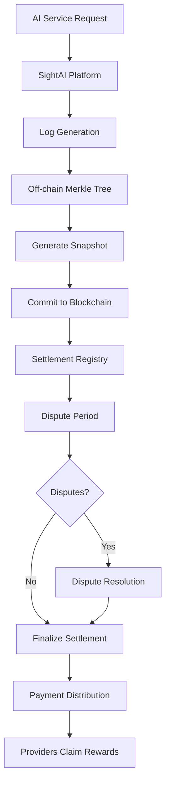

# NTU Blockchain Capstone: On-Chain Settlement Layer for Multi-Modal AI Services

## Project Title
**"Settle: Blockchain-Based Verifiable Settlement System for Multi-Modal AI Platforms"**

## Executive Summary

This project challenges students to build a blockchain-based settlement and verification layer for the SightAI platform, which handles text, image, and video AI generation services. While the core verification logic uses Merkle Trees off-chain, the blockchain provides immutable settlement records, dispute resolution, and trustless payment distribution.

**Duration**: 8 weeks  
**Team Size**: 1-2 students  
**Prerequisites**: Blockchain fundamentals, Solidity, understanding of Merkle Trees

## The Problem: Multi-Modal AI Settlement

### Current SightAI Platform Context

SightAI connects:
- **Users**: Need AI services (text generation, image creation, video synthesis)
- **API Providers**: Share their API keys (OpenAI, Midjourney, Runway) for profit
- **Platform**: Routes requests and handles settlements

### The Trust Challenge

Current issues in the reward verification system:

1. **High-Value Transactions**
   - Text: $0.001-0.05 per request
   - Image: $0.10-0.50 per image
   - Video: $5-50 per generation
   - A single video dispute = significant money

2. **Verification Complexity**
   - Different metrics: tokens (text), count (images), seconds (video)
   - Providers can't verify platform calculations
   - Users can't verify charges

3. **Settlement Disputes**
   - No arbiter when provider claims underpayment
   - No recourse when user claims overcharge
   - Platform controls all data

4. **Payment Distribution**
   - Provider gets 90%
   - Platform gets 5%
   - User pays 95% (5% subsidy)
   - No transparent distribution mechanism

## Proposed Blockchain Solution

Students will build a blockchain layer that complements the off-chain Merkle Tree verification with on-chain settlement and dispute resolution.

```
Off-Chain (Fast Processing)          On-Chain (Settlement & Trust)
━━━━━━━━━━━━━━━━━━━━━━━━━          ━━━━━━━━━━━━━━━━━━━━━━━━━━━
• Log aggregation              →     • Settlement commitments
• Merkle Tree generation       →     • Payment distribution
• Proof generation             →     • Dispute resolution
• API endpoints                →     • Immutable audit trail
```

## Core Components to Build

### Component 1: Settlement Registry Smart Contract (35%)

Records and manages reward settlements for all modalities.

```solidity
contract SettlementRegistry {
    struct Settlement {
        bytes32 settlementId;
        uint256 epoch;
        bytes32 merkleRoot;      // From off-chain system
        uint256 timestamp;
        SettlementDetails details;
        bool isFinalized;
        bool disputeRaised;
    }
    
    struct SettlementDetails {
        uint256 totalTextCalls;
        uint256 totalImageGenerations;
        uint256 totalVideoSeconds;
        uint256 totalProviderRewards;
        uint256 totalPlatformFees;
        uint256 totalUserPayments;
    }
    
    struct ProviderSettlement {
        address provider;
        bytes32 apiKeyHash;
        ModalityBreakdown breakdown;
        uint256 totalReward;
        bool claimed;
        bool disputed;
    }
    
    struct ModalityBreakdown {
        uint256 textReward;      // From LLM calls
        uint256 imageReward;     // From image generation
        uint256 videoReward;     // From video generation
        uint256 textCalls;
        uint256 imageCount;
        uint256 videoSeconds;
    }
}
```

**Key Features:**
- Commit epoch settlements with merkle roots
- Track multi-modal usage (text/image/video)
- Manage payment claims
- Handle settlement finalization

### Component 2: Multi-Modal Pricing Oracle (25%)

Manages pricing for different AI services and calculates distributions.

```solidity
contract PricingOracle {
    struct PricingTier {
        uint256 textPricePerKToken;    // e.g., $0.01/1K tokens
        uint256 imagePricePerUnit;     // e.g., $0.10/image
        uint256 videoPricePerSecond;   // e.g., $0.50/second
        uint256 providerShare;         // 90%
        uint256 platformShare;         // 5%
        uint256 userDiscount;          // 5%
    }
    
    mapping(string => PricingTier) public modelPricing;
    
    function calculateRewards(
        uint256 textTokens,
        uint256 imageCount,
        uint256 videoSeconds,
        string memory model
    ) public view returns (
        uint256 providerReward,
        uint256 platformFee,
        uint256 userCost
    );
}
```

**Key Features:**
- Different pricing for each modality
- Model-specific pricing (GPT-4 vs Claude vs Midjourney)
- Automatic distribution calculation
- Price update mechanism with timelock

### Component 3: Dispute Resolution System (25%)

Handles disputes when providers or users challenge settlements.

```solidity
contract DisputeResolver {
    struct Dispute {
        bytes32 disputeId;
        bytes32 settlementId;
        address challenger;
        DisputeType disputeType;
        bytes32[] proofData;
        uint256 stakeAmount;
        DisputeStatus status;
        uint256 resolution;
    }
    
    enum DisputeType {
        IncorrectTextTokens,
        MissingImageGenerations,
        WrongVideoDuration,
        IncorrectRewardCalculation,
        MissingTransactions
    }
    
    enum DisputeStatus {
        Pending,
        UnderReview,
        Resolved,
        Rejected
    }
    
    function raiseDispute(
        bytes32 settlementId,
        DisputeType disputeType,
        bytes32[] memory merkleProof
    ) external payable;
    
    function resolveDispute(
        bytes32 disputeId,
        bool valid,
        uint256 correctAmount
    ) external onlyArbiter;
}
```

**Key Features:**
- Stake-based dispute raising (prevent spam)
- Merkle proof submission
- Multi-modal dispute types
- Slashing for false disputes
- Compensation for valid disputes

### Component 4: Payment Distribution Contract (15%)

Automates payment distribution based on verified settlements.

```solidity
contract PaymentDistributor {
    struct PaymentBatch {
        bytes32 settlementId;
        uint256 totalAmount;
        uint256 distributed;
        mapping(address => bool) claimed;
    }
    
    function initiatePayment(bytes32 settlementId) external;
    
    function claimReward(
        bytes32 settlementId,
        bytes32[] memory merkleProof
    ) external;
    
    function batchDistribute(
        address[] memory providers,
        uint256[] memory amounts
    ) external onlyOwner;
    
    // Emergency functions
    function pausePayments() external onlyOwner;
    function emergencyWithdraw() external onlyOwner;
}
```

## Technical Architecture



## Implementation Roadmap (8 Weeks)

### Week 1-2: Settlement Registry
**Deliverables:**
- Settlement struct definitions
- Commit settlement function
- Multi-modal tracking
- Basic tests

**Key Implementation:**
```solidity
function commitSettlement(
    uint256 epoch,
    bytes32 merkleRoot,
    SettlementDetails memory details,
    ProviderSettlement[] memory providers
) external onlyPlatform {
    // Validate totals match
    require(validateTotals(details, providers), "Invalid totals");
    
    // Store settlement
    settlements[epoch] = Settlement({
        settlementId: keccak256(abi.encode(epoch, merkleRoot)),
        epoch: epoch,
        merkleRoot: merkleRoot,
        timestamp: block.timestamp,
        details: details,
        isFinalized: false,
        disputeRaised: false
    });
    
    // Store provider details
    for (uint i = 0; i < providers.length; i++) {
        providerSettlements[epoch][providers[i].provider] = providers[i];
    }
    
    emit SettlementCommitted(epoch, merkleRoot, details.totalProviderRewards);
}
```

### Week 3: Pricing Oracle
**Deliverables:**
- Multi-modal pricing structure
- Reward calculation functions
- Price update mechanism
- Integration tests

### Week 4: Dispute System
**Deliverables:**
- Dispute raising with stake
- Proof submission
- Basic resolution logic
- Slashing mechanism

### Week 5: Payment Distribution
**Deliverables:**
- Payment initiation
- Claim mechanism
- Batch distribution
- Emergency controls

### Week 6: Integration with Off-Chain System
**Deliverables:**
- Mock off-chain Merkle Tree generator
- API to fetch proofs
- Settlement commitment script
- End-to-end testing

### Week 7: Testing & Security
**Deliverables:**
- Comprehensive test suite
- Gas optimization
- Security audit checklist
- Reentrancy protection

### Week 8: Demo & Documentation
**Deliverables:**
- Working demo with UI
- Complete documentation
- Video demonstration
- Deployment scripts

## Integration with Off-Chain Verification

The blockchain contracts work with the existing off-chain system:

```javascript
// Off-chain system generates snapshot
const snapshot = {
    epoch: 1,
    merkleRoot: "0xabc...",
    channels: [
        {
            apiKeyHash: "0x123...",
            model: "gpt-4",
            totalTokens: 1000000,
            providerReward: ethers.parseEther("100")
        },
        {
            apiKeyHash: "0x456...",
            model: "midjourney",
            imageCount: 500,
            providerReward: ethers.parseEther("50")
        },
        {
            apiKeyHash: "0x789...",
            model: "runway",
            videoSeconds: 300,
            providerReward: ethers.parseEther("150")
        }
    ]
};

// Commit to blockchain
const tx = await settlementRegistry.commitSettlement(
    snapshot.epoch,
    snapshot.merkleRoot,
    aggregateDetails(snapshot),
    snapshot.channels
);
```

## Real-World Scenario

### Daily Settlement Flow

```
Morning: Platform processes 10,000 AI requests
- 8,000 text (GPT-4, Claude)
- 1,500 images (Midjourney, DALL-E)
- 500 videos (Runway, Pika)

Afternoon: Off-chain system generates snapshot
- Merkle root: 0xdef...
- Total provider rewards: 500 ETH
- Total platform fees: 27.7 ETH

Evening: Commit to blockchain
- Settlement registered on-chain
- 24-hour dispute window opens
- Providers verify their rewards

Next Day:
- 2 disputes raised (both video-related)
- 1 valid (missing 20 seconds) → compensation
- 1 invalid (incorrect claim) → stake slashed
- Settlement finalized
- Payments distributed
```

## Smart Contract Examples

### Core Settlement Logic
```solidity
// Simplified example
contract SettlementCore {
    uint256 constant DISPUTE_PERIOD = 24 hours;
    uint256 constant MIN_DISPUTE_STAKE = 0.1 ether;
    
    modifier settlementExists(uint256 epoch) {
        require(settlements[epoch].epoch != 0, "Settlement not found");
        _;
    }
    
    modifier withinDisputePeriod(uint256 epoch) {
        require(
            block.timestamp <= settlements[epoch].timestamp + DISPUTE_PERIOD,
            "Dispute period ended"
        );
        _;
    }
    
    function finalizeSettlement(uint256 epoch) 
        external 
        settlementExists(epoch) 
    {
        Settlement storage settlement = settlements[epoch];
        require(!settlement.isFinalized, "Already finalized");
        require(
            block.timestamp > settlement.timestamp + DISPUTE_PERIOD,
            "Dispute period active"
        );
        require(!settlement.disputeRaised, "Unresolved dispute");
        
        settlement.isFinalized = true;
        
        // Enable payment claims
        paymentDistributor.enableClaims(settlement.settlementId);
        
        emit SettlementFinalized(epoch, settlement.merkleRoot);
    }
}
```

## Learning Outcomes

Students will master:

1. **Multi-Modal Settlement Systems**: Handling different pricing models and metrics
2. **Hybrid Architecture**: Combining off-chain efficiency with on-chain trust
3. **Dispute Resolution**: Building fair arbitration mechanisms
4. **Payment Distribution**: Automated, trustless payment systems
5. **Merkle Proof Verification**: On-chain verification of off-chain data
6. **High-Value Transaction Handling**: Where mistakes cost real money

## Evaluation Criteria

### Core Implementation (50%)
- Settlement registry functionality
- Multi-modal pricing support
- Dispute mechanism
- Payment distribution

### Security & Testing (25%)
- No critical vulnerabilities
- Comprehensive test coverage
- Gas optimization
- Edge case handling

### Integration (15%)
- Off-chain system mock
- Proof verification
- End-to-end flow

### Documentation (10%)
- Clear README
- API documentation
- Architecture diagrams

## Key Differentiators

This project differs from previous blockchain capstones by:

1. **Multi-Modal Focus**: Handles text, image, AND video pricing
2. **High Stakes**: Video generation = $50/request (errors matter!)
3. **Hybrid Design**: Off-chain Merkle Trees + on-chain settlement
4. **Real Economics**: Actual provider/platform/user split
5. **Dispute Complexity**: Different dispute types per modality

## Success Metrics

### MVP Requirements
- [ ] Settlement commitment working
- [ ] Multi-modal pricing calculations
- [ ] Basic dispute mechanism
- [ ] Payment claims functional
- [ ] Gas < 300k for settlement commit

### Good Implementation
- [ ] All MVP features
- [ ] Comprehensive dispute types
- [ ] Batch payment distribution
- [ ] Mock integration working
- [ ] 90% test coverage

### Excellent Implementation
- [ ] Advanced dispute resolution
- [ ] Gas optimized < 200k
- [ ] Emergency mechanisms
- [ ] Professional UI demo
- [ ] Production-ready security

## Why This Project Matters

**Current AI Economy Issues:**
- Providers sharing $1000s worth of API keys
- No transparent settlement mechanism
- High-value video generation disputes
- Trust-based payment distribution

**What SettleChain Solves:**
- ✅ Immutable settlement records
- ✅ Transparent multi-modal pricing
- ✅ Fair dispute resolution
- ✅ Automated payment distribution
- ✅ Trustless verification

---

*"Building trust in the AI economy through transparent, verifiable settlements across text, image, and video generation."*